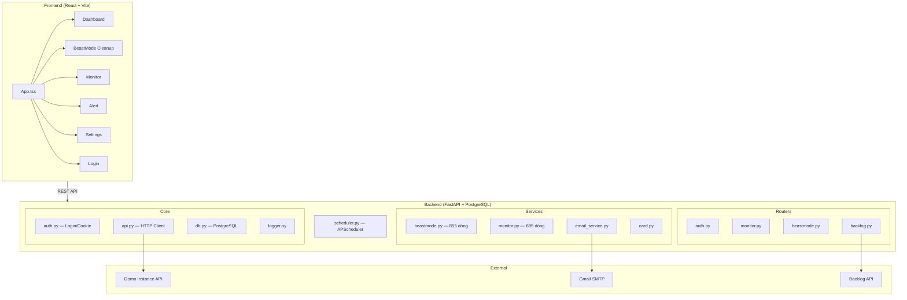
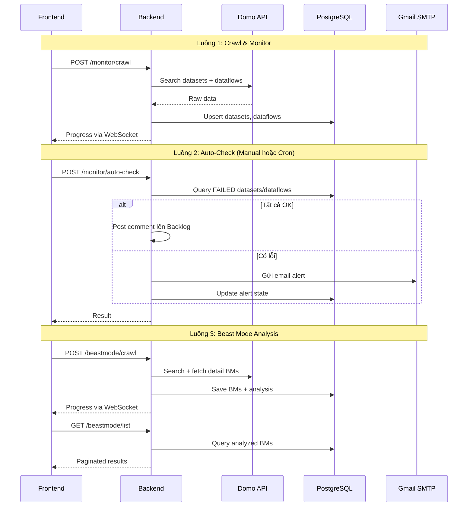

# 🔍 Domo Toolkit — System Review

## Tổng quan kiến trúc

---

## 📋 Chức năng từng module

### 1. 🔐 Authentication (`/api/auth`)
| Endpoint | Mô tả |
|---|---|
| `POST /login` | Login Domo bằng username/password (hỗ trợ auto-login từ .env) |
| `POST /upload-cookies` | Import session từ J2 Team Cookie extension |
| `GET /status` | Kiểm tra session hiện tại (valid trong 8h) |

- Session lưu vào DB (`domo_sessions`), tái sử dụng khi restart
- Hỗ trợ cookie-based auth cho Domo private API

---

### 2. 🐉 Beast Mode Cleanup (`/api/beastmode`)
**Mục đích**: Phân tích và dọn dẹp Beast Mode (calculated fields) dư thừa trên Domo

| Chức năng | Chi tiết |
|---|---|
| **Crawl** | Crawl toàn bộ BM qua search API (batch 1000) |
| **Fetch detail** | Async fetch formula, dataset mapping, view count cho từng BM |
| **Phân tích 4 nhóm** | Nhóm 1 (không dùng), Nhóm 2 (xem nhưng k dùng), Nhóm 3 (dùng ít), Nhóm 4 (dùng nhiều) |
| **Duplicate detection** | 3 lớp: exact hash, normalized hash, structure hash + name duplicates |
| **Dataset stats** | Thống kê BM theo dataset, link trực tiếp tới Domo datasource |
| **Reanalyze** | Phân tích lại từ DB có sẵn (không crawl lại) |
| **WebSocket** | Real-time progress updates cho crawl/analyze |
| **Pagination** | Client-side 50 items/page |

> **Blocker hiện tại**: API xóa BM trả 500 — cần investigate endpoint `PUT /api/content/v3/cards/kpi/table/query`

---

### 3. 📊 Monitor (`/api/monitor`)
**Mục đích**: Giám sát trạng thái Dataset & Dataflow trên Domo

| Chức năng | Chi tiết |
|---|---|
| **Crawl datasets** | Search + fetch detail cho tất cả datasets |
| **Crawl dataflows** | Search + fetch execution history |
| **Health check** | Phân loại: OK / Stale / Failed dựa trên filter (stale_hours, min_card_count, provider_type) |
| **Auto-check** | Kiểm tra failed → gửi email alert + post Backlog nếu OK |
| **Dataset schedule** | Xem schedule / execution history qua Stream API |
| **Execution history** | Xem chi tiết lịch sử run của dataflow |

---

### 4. ⚙️ Settings (`/settings`)
**Mục đích**: Cấu hình hệ thống

| Config | Lưu ở | Chi tiết |
|---|---|---|
| Domo credentials | `.env` | Instance, username, password |
| Gmail SMTP | `.env` | Email + app password |
| Alert email recipients | DB `app_settings` | Nhiều email, phẩy phẩy |
| Min card count | DB `app_settings` | Threshold cho auto-check |
| Schedule auto-check | DB `app_settings` | Bật/tắt, giờ, phút, ngày trong tuần |
| Backlog config | `.env` | Base URL, issue ID, CSRF token |

---

### 5. 🚨 Alert (`/alert`)
- Hiển thị danh sách Dataset/Dataflow đang FAILED
- Link trực tiếp tới Domo để xem chi tiết
- Auto-refresh từ DB nếu in-memory trống

---

### 6. ⏰ Scheduler (`app/scheduler.py`)
- APScheduler với cron trigger, timezone `Asia/Tokyo`
- Mặc định: Mon-Fri 8:00 JST
- Khi triggered: gọi `trigger_auto_check()` → crawl DB → check failed → gửi email
- Config lưu trong DB, update động khi FE save

---

## 🗄️ Database Schema (PostgreSQL)

| Bảng | Mục đích |
|---|---|
| `domo_sessions` | Lưu Domo auth session |
| `beast_modes` | Tất cả BM crawled |
| `bm_analysis` | Kết quả phân tích BM (group, hash, view count) |
| `bm_card_map` | Mapping BM ↔ Card |
| `cards` | Domo cards |
| `datasets` | Tất cả datasets + trạng thái |
| `dataflows` | Tất cả dataflows + execution state |
| `monitor_checks` | Lịch sử health check |
| `app_settings` | Key-value config (email, schedule) |

---

## 🔗 Luồng dữ liệu chính

---

## ⚠️ Vấn đề phát hiện

### Nghiêm trọng
1. **Duplicate method `fetch_dataset_detail`** trong [monitor.py](file:///d:/DOMO/domo_toolkit/backend/app/services/monitor.py#L132-L203) — định nghĩa 2 lần (dòng 132 và 190), method thứ 2 sẽ ghi đè method đầu → method kia không bao giờ được gọi
2. **`_get_db()` gọi trước khi define** — `_load_alert_config()` ở module level (dòng 92) gọi `_get_db()` (dòng 95), nhưng `_get_db()` định nghĩa ở dòng 98. Khi import module lần đầu, nếu DB chưa sẵn sàng sẽ catch exception và dùng default — không phải lỗi crash nhưng config sẽ trống mỗi lần restart cho đến khi FE save lại

### Cần cải thiện
3. **DB connections không pooled** — mỗi request tạo connection mới qua `_get_db()`, không dùng connection pool → chậm khi load cao
4. **Debug prints** — nhiều `print(f"[DEBUG ...]")` nên chuyển sang logger hoặc xóa trước production
5. **Hardcoded Domo URL** trong [Alert.tsx](file:///d:/DOMO/domo_toolkit/frontend/src/pages/Alert.tsx#L6) — `DOMO_BASE = 'https://astecpaints-co-jp.domo.com'` nên lấy từ API config
6. **`os.path.join` cho JSON config** trong monitor.py — đã xóa JSON file nhưng `import os` và `import json` vẫn được dùng, clean nếu không cần
7. **Email type `input`** — đã đổi từ `type="email"` sang `type="text"` cho multi-email, OK

### Nice to have
8. **Rate limiting** trên API endpoints — hiện không có auth/rate limit cho public endpoints
9. **Centralized error handling** — mỗi router tự try/catch, nên dùng FastAPI exception handler
10. **Frontend state management** — mỗi page tự manage state, nên dùng context/zustand nếu scale lên
